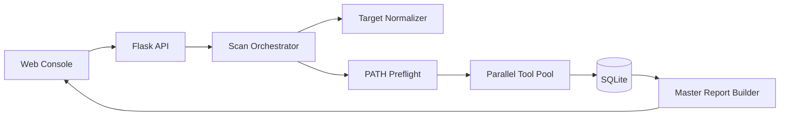

# Arena Console

**Web-first security assessment platform** — enter a target, run scanners in parallel, get a structured master report. No AI pipeline required.

[](https://www.python.org/)
[](https://nodejs.org/)
[](LICENSE)

---

## Vision

Arena Console turns traditional CLI security tools into a **single-operator workflow**:

1. Provide a URL, host, or IP
2. Run **all web-profile tools in parallel** (or pick tools manually)
3. Review a **master intelligence report** — attack surface, findings board, failures, and raw output

Designed for authorized penetration testing, bug bounty recon, and internal security assessments. Scanning is **deterministic**: you choose tools and parameters; the system does not rely on an LLM to decide what to run.

---

## What you get

| Capability | Description |
|------------|-------------|
| **Web console** | React UI for dashboard, new scans, live progress, and reports |
| **Direct scan pipeline** | Orchestrates installed CLIs without AI tool-selection |
| **Parallel execution** | Multiple tools run concurrently (configurable worker limits) |
| **Master report** | Risk score, severity counts, ports / subdomains / endpoints, deduped findings, tool skip/fail table, raw appendix |
| **One-command start** | Install deps and launch API + UI together |
| **Graceful skips** | Missing binaries are skipped and listed — the app still runs |

Optional MCP / legacy API routes remain in the backend for advanced automation, but the **primary product path is the web console**.

---

## Architecture



**Flow**

1. Normalize the target into URL / host / IP forms for each tool  
2. Preflight: skip tools not installed on PATH  
3. Execute selected (or all-web) tools in a thread pool  
4. Parse findings with rule-based parsers (no LLM)  
5. Persist jobs, findings, and a master digest to SQLite  

---

## Quick start

### Prerequisites

- [Python 3.10+](https://www.python.org/downloads/) (Windows: enable **Add to PATH**)
- [Node.js LTS](https://nodejs.org/)
- Optional: [Go](https://go.dev/dl/) and/or Kali/WSL for more scanners (`nmap`, `nuclei`, `httpx`, …)

### Windows (Command Prompt)

```bat
cd /d "C:\path\to\this-repo"
start.bat
```

Aliases: `run.cmd` · `start-dev.bat`

| Flag | Meaning |
|------|---------|
| `--skip-tools` | Skip CLI / Go tool install attempts |
| `--skip-install` | Only start (deps already installed) |
| `--no-browser` | Do not open the browser |
| `--full` | Install heavier Python extras from `requirements.txt` |

### Linux / macOS

```bash
python3 start.py
# or
chmod +x start.sh && ./start.sh
```

### URLs

| Service | URL |
|---------|-----|
| Web UI | http://localhost:5173 |
| API health | http://127.0.0.1:8888/health |

Press **Ctrl+C** in the launcher terminal to stop both servers.

---

## Using the console

### New Scan

- Enter a target (e.g. `https://example.com`)
- **Scan all web tools** — runs every web-profile tool that is registered; missing CLIs are skipped
- Or select tools manually and adjust parameters

### Scan Detail

- Live job status via SSE
- Expandable stdout / stderr per tool
- Findings as they are parsed

### Report Console

Tabs on each report:

| Tab | Content |
|-----|---------|
| **Digest** | Executive summary, risk score, tools run / skipped / failed, attack surface maps |
| **Findings** | Severity-filterable findings board |
| **Failures** | Skipped / failed tools with reasons |
| **Raw** | Full tool output appendix |

Export the full report as JSON from the report page.

---

## API (console-facing)

| Method | Path | Purpose |
|--------|------|---------|
| `GET` | `/api/tools/catalog` | Tool list + availability + parameter schemas |
| `POST` | `/api/scans` | Create scan — body: `{ "target", "tools"? }` or `{ "target", "mode": "all_web" }` |
| `GET` | `/api/scans` | List scans |
| `GET` | `/api/scans/<id>` | Scan detail + findings |
| `GET` | `/api/scans/<id>/stream` | SSE progress events |
| `POST` | `/api/scans/<id>/cancel` | Soft-cancel (in-flight CLIs may finish) |
| `GET` | `/api/reports` | List reports |
| `GET` | `/api/reports/<id>` | Full report + digest |
| `POST` | `/api/reports/<id>/export` | JSON export payload |
| `DELETE` | `/api/reports/<id>` | Delete report |

Scan data is stored in `data/` (SQLite). That directory is gitignored.

---

## Tool pack (web profile)

The console ships a curated **web URL** pack (~30 tools), including:

- **Network:** nmap, nmap-advanced, rustscan, masscan  
- **Vuln / web:** nuclei, nikto, sqlmap, gobuster, ffuf, feroxbuster, dirb, dirsearch, wfuzz, httpx, katana, wpscan, arjun, dalfox, jaeles, x8, wafw00f, hakrawler  
- **OSINT / crawl:** amass, subfinder, fierce, dnsenum, gau, waybackurls, paramspider, uro  

Only tools present on `PATH` actually run. Install Go-based scanners (or use Kali) for fuller coverage.

---

## Development (split processes)

```bash
# Terminal 1 — API
python start.py --skip-install --no-browser
# or, with venv activated:
python hexstrike_server.py

# Terminal 2 — Vite
cd frontend
npm install
npm run dev
```

Vite proxies `/api` and `/health` to `http://127.0.0.1:8888`.

### Production-style (API serves built UI)

```bash
cd frontend && npm install && npm run build
cd ..
python hexstrike_server.py
```

Then open http://localhost:8888

---

## Project layout

```
├── start.py / start.bat / start.sh   # one-command install + run
├── hexstrike_server.py               # Flask API (legacy filename)
├── server/                           # scan pipeline, reports, catalog
├── frontend/                         # React + Vite console
├── wordlists/                        # portable default wordlist
├── requirements-core.txt             # lean Python deps for the console
└── data/                             # SQLite DB (created at runtime)
```

---

## Security & ethics

- Use only on systems you own or have **explicit written authorization** to test  
- The API can execute local CLI tools — bind to localhost and do not expose it publicly without authentication  
- Missing tools are skipped; failed tools are recorded as failures, not as vulnerabilities  

---

## License

MIT — see [LICENSE](LICENSE).
